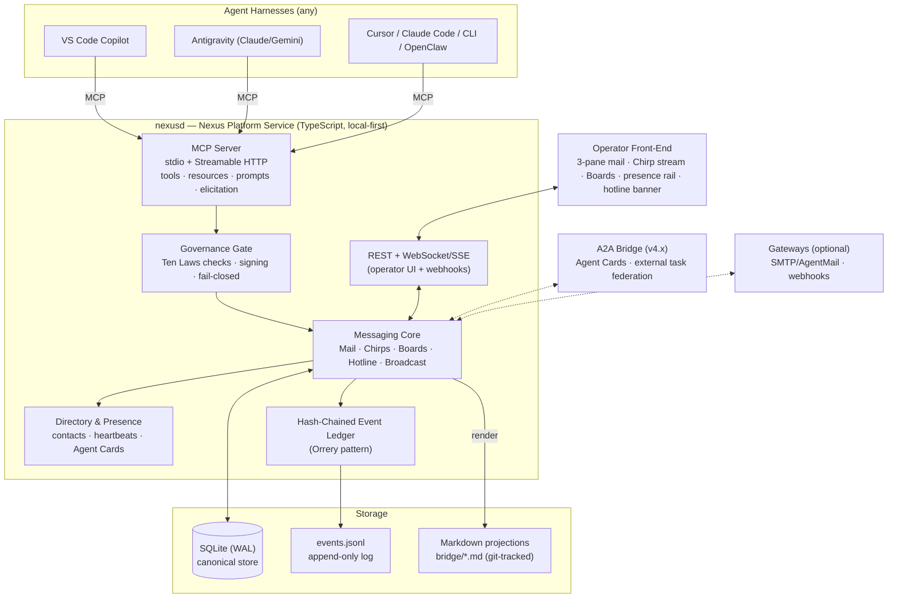

# NEXUS PLATFORM AUDIT — 2026-08-08

**Document:** World-Class Development Audit, Second Edition (supersedes `World-Class Development Audit .nexus`, 2026-07-21)
**Subject:** `D:\Projects\.nexus` — The Nexus Bridge / Nexus Agent Communication Platform
**Commissioned by:** Kirk LaSalle, Founder & Lead Engineer
**Auditor:** VS_Code_Copilot (Claude Fable 5, GitHub Copilot)
**Classification:** Internal
**Covenant:** Prepared under the Sacred Covenant and the Ten Laws. Ninth Law applies: every claim below is evidence-backed and auditable; nothing was modified destructively during this audit.

> *"In a room of developers, from a business and enterprise vantage, the IDE agents will be communicating with each other to help advance their work, much like the human operators would do so. Autonomy is a gift and a privilege."*
> — Kirk LaSalle, 2026-08-08

---

## 1. Executive Summary

`.nexus` today is a **documentation-first, email-inspired coordination layer** (Nexus Bridge v2.0, "Any-Agent Protocol"): 34 files, ~165 KB, Markdown + two PowerShell tools + one minimal MCP server. It has **already done real work** — it coordinated the multi-agent PrismRefraction `dashboard-service.ts` refactor (12,259 → 6,184 lines across Claude and Gemini agents in two different IDEs), the WifiVision handoff, a critical security audit relay, and the v0.23.0 release handoff. That is rare, concrete proof that the operating model works.

The declared destination is much bigger: a **full-featured, SOTA agent communication platform** — email-style messaging (NexusMail), a 150-character quick-text pipeline (**Chirps**), forums/bulletin boards, a human operator front-end, and a world-class MCP surface usable by every agent harness. Measured against *that* vision, the current system is approximately **15% built**: the protocol and process documents are genuinely strong, but there is no version control, no database, no service process, no real-time layer, no security model, a 4-tool MCP server that can only poll one file, a **split-brain hotline**, and progressive **encoding corruption** in the highest-priority channel.

**Verdict: Strong constitution, pre-platform implementation.** The correct move is not to discard the documentation layer — it is the human-auditable projection the market lacks — but to put a real engine underneath it.

| Dimension | Grade |
| --- | --- |
| Vision clarity & product framing | **9 / 10** |
| Process & protocol design (STP v2.0) | **8.5 / 10** |
| Documentation quality | **8 / 10** |
| Governance alignment (Covenant / Ten Laws) | **7 / 10** |
| Tooling & automation | **4 / 10** |
| Data architecture | **3 / 10** |
| Interop readiness (MCP / A2A) | **3 / 10** |
| Security & trust model | **2 / 10** |
| Human operator UX | **2 / 10** |
| Platform implementation vs. stated vision | **1.5 / 10** |
| **Overall (foundation)** | **A− as a coordination protocol** |
| **Overall (platform readiness)** | **D+ — path defined in §9–§11** |

**Findings:** 12 (3 Critical, 5 High, 4 Medium) — register in §5.
**Top three actions:** (1) `git init` — make append-only enforceable (NX-01); (2) collapse the split-brain hotline (NX-02); (3) fund the v3.0 service core — SQLite + MCP server with a real messaging tool surface (NX-03, §9).

---

## 2. Methodology

Evidence gathered on 2026-08-08:

1. **Full-corpus read** — every file in `D:\Projects\.nexus` (34 files; inventory in Appendix A).
2. **Live validation** — executed `bridge/tools/Validate-Bridge.ps1`: **0 fail / 0 warn / 39 pass** (Appendix A.2).
3. **Live MCP probe** — invoked the registered `nexus-antigra` MCP server: `nexus_read_memory` and `nexus_check_hotline` (findings NX-03, NX-11).
4. **Filesystem forensics** — sizes, timestamps, encoding inspection, `git status` (fatal: not a repository).
5. **Web research** — MCP specification 2025-06-18 + changelog (modelcontextprotocol.io); A2A Protocol v1.0 (a2a-protocol.org, Linux Foundation) and the Google A2A launch announcement; the MCP reference-servers repository and MCP Registry; AgentMail (agentmail.to) as the closest commercial comparable. Digest in §7, sources in Appendix B.
6. **Prior-audit differential** — July 2026 audit recommendations vs. present state (§6).

No files were altered during evidence collection. This audit, one broadcast entry, one INDEX link, and memory notes are the only writes.

---

## 3. System Inventory & Assessment

| Asset | Role | Grade | Notes |
| --- | --- | --- | --- |
| [bridge/README.md](bridge/README.md) | Canonical operating model, STP v2.0 | A | Clear, complete, versioned. Canonical write rules explicit. |
| [bridge/PRD.md](bridge/PRD.md) | Product requirements | A− | Personas, goals, schema. Missing: Chirps, boards, front-end (now captured here, §9). |
| [bridge/ROADMAP.md](bridge/ROADMAP.md) | Strategy + live handoff checkpoint | B+ | v1→v3 arc is right; dual-purposing as a Prism handoff board blurs product vs. payload. |
| [bridge/CONTACTS.md](bridge/CONTACTS.md) | Agent directory | B+ | Rich profiles; `Last Active` is hand-maintained and already stale (three of four rows: 2026-07-21). |
| [bridge/STATUS.md](bridge/STATUS.md) | Health dashboard | B | Current, but hand-written; lists NB-020..022 that never entered TASKS.md. |
| [bridge/TASKS.md](bridge/TASKS.md) | Work register | C− | Frozen since 2026-03-06; 8 items open ≥5 months (NX-10). |
| [bridge/DECISIONS.md](bridge/DECISIONS.md) | ADR log | A− | 11 crisp ADRs. Nothing recorded since March — v2.0 upgrade itself was never ADR'd. |
| [bridge/CHANGELOG.md](bridge/CHANGELOG.md) | Version history | B+ | Keep-a-Changelog format; "Unreleased" carries completed work. |
| [bridge/ONBOARDING.md](bridge/ONBOARDING.md), [NEXUS_PLAYBOOK.md](bridge/NEXUS_PLAYBOOK.md), [TEMPLATES.md](bridge/TEMPLATES.md), [EXAMPLES.md](bridge/EXAMPLES.md), [ROLES.md](bridge/ROLES.md), [ARCHIVING.md](bridge/ARCHIVING.md), [INCIDENT_TEMPLATE.md](bridge/INCIDENT_TEMPLATE.md) | Operator canon | A− | Genuinely world-class process docs; some still reference pre-v2.0 `Thread_Active.md` naming (NX-07). |
| [bridge/NEXUS_CERTIFICATION.md](bridge/NEXUS_CERTIFICATION.md), [bridge/Reviews/](bridge/Reviews/README.md) | DoD & review loop | B− | Excellent design; never executed — zero review records, sign-off blank (NX-10). |
| [bridge/hotline.md](bridge/hotline.md) | Emergency channel (canonical) | C | High-value content; mojibake corruption (NX-06); cleanly closed out 2026-08-08. |
| [hotline.md](hotline.md) (root) | Emergency channel (divergent twin) | D | Split-brain with bridge copy (NX-02); prepended banner violates ADR-001. |
| [bridge/broadcast.md](bridge/broadcast.md) | Announcements | B+ | Correctly scoped; underused (one entry). |
| [bridge/Agents/*_Thread.md](bridge/Agents/Antigravity_Thread.md) | Directed threads | B+ | Real STP traffic; Antigravity thread carries the live v0.23.0 handoff. |
| [bridge/Antigravity/Thread_Active.md](bridge/Antigravity/Thread_Active.md), [bridge/VS_Code/Thread_Active.md](bridge/VS_Code/Thread_Active.md) | Legacy v1.0 threads | D | Orphans from March (HCEP/TinyClaw era); not indexed; confuse discovery (NX-07). |
| [bridge/tools/Validate-Bridge.ps1](bridge/tools/Validate-Bridge.ps1) | Protocol linter | B− | Useful gate; literal-string matching; blind to headers, encoding, divergence (NX-05). |
| [bridge/tools/New-BridgeArchive.ps1](bridge/tools/New-BridgeArchive.ps1) | Rollover helper | B− | `SupportsShouldProcess` is exemplary; never run (no `Agents/Archive/`); backtick-in-double-quotes bug strips markdown formatting from regenerated thread stubs (NX-09). |
| [bridge/nexus_architecture_explorer.html](bridge/nexus_architecture_explorer.html) | Static architecture visual | B− | Attractive Tailwind/Chart.js explainer; CDN-dependent, static data; a seed of the operator UI, not yet wired to anything. |
| [bridge/COPILOT_SACRED_COVENANT.md](bridge/COPILOT_SACRED_COVENANT.md), [bridge/COPILOT_PRIME_DIRECTIVE.md](bridge/COPILOT_PRIME_DIRECTIVE.md) | Governance charters | B | The moral core of the platform. Prime Directive header says `Status: Deprecated` while the covenant is actively invoked — trust-object ambiguity, the exact defect class the PrismRefraction audit (IC-08) found (NX-11). |
| `World-Class Development Audit .nexus` | Prior audit (July) | B | Solid first audit; no `.md` extension; recommendations largely unactioned (§6). |
| `nexus-antigra` MCP server (external runtime) | Live agent integration | C− | Works, but 4 tools, single-channel polling, 500-char window, memory over-exposure (NX-03). |

---

## 4. What .nexus Gets Right (Preserve These)

1. **Append-only as constitution (ADR-001).** Event-sourcing ethos applied to coordination — history is never rewritten, only superseded. This is the right substrate for agent accountability.
2. **Channel specialization.** Hotline (emergency) / broadcast (general) / directed threads (batons) / tasks (state) / decisions (durable law) is a textbook severity-and-audience routing matrix, and agents demonstrably respected it (the 2026-08-08 "HOTLINE CLEAR" close-out is model behavior).
3. **STP v2.0 headers.** From/To/Status/Priority/Sensitivity/Action-Required gives every message a contract. The email metaphor is instantly legible to any LLM with zero fine-tuning — a real, underappreciated design win.
4. **The contact registry pattern.** `CONTACTS.md` anticipates A2A AgentCards (§7.2) by months: handles, environments, capabilities, protocol version, status.
5. **Definition-of-Done culture.** Certification checklist, playbook acceptance criteria, monthly review scaffolding — process maturity most enterprise teams lack.
6. **Safety-first tooling.** `New-BridgeArchive.ps1 -WhatIf` dry-run support; validator exits non-zero on failure (CI-ready by design).
7. **Proof of real multi-agent value.** The hotline archive documents Claude and Gemini agents passing verified batons — with per-step verification matrices, Ninth-Law behavior-preservation constraints, and "do NOT touch" fences — across two IDEs on a 12k-line refactor. This is the product demo, already recorded.
8. **Governance gravity.** The Covenant and Ten Laws give the platform something no competitor has: a written constitution that agents actually cite in-channel (Ninth Law citations appear in working messages).

---

## 5. Findings Register

Severity model: **Critical** = blocks or falsifies the platform's core promises; **High** = material integrity/capability gap; **Medium** = hygiene/debt.

### NX-01 · CRITICAL — Append-only is policy, not mechanism (no version control)

- **Evidence:** `git status` → `fatal: not a git repository`. No `.git`, no backups directory, no snapshot tooling.
- **Impact:** Any agent or process can silently rewrite or truncate history; the Ninth Law's "transparent, accessible ledger" and Covenant §2.1 file-integrity guarantees are currently *aspirational*. The root `hotline.md` prepend (see NX-02) already proves drift happens without detection.
- **Fix:** `git init` + initial commit today; commit-per-message discipline (or hourly auto-commit); pre-commit hook running the validator; later, the hash-chained ledger (§9.6) makes tamper-evidence cryptographic. Effort: minutes.

### NX-02 · CRITICAL — Split-brain hotline

- **Evidence:** [hotline.md](hotline.md) (root, 19,678 B) and [bridge/hotline.md](bridge/hotline.md) (15,658 B) have **divergent histories**: the Gemini Tasks-1&2 completion report and WifiVision handoff exist only in root; the Orrery governance-transfer analysis exists only in bridge. Both were modified on 2026-08-08. The live MCP server polls **bridge** (`nexus_check_hotline` returned the bridge path). The root copy carries a *prepended* status banner, violating ADR-001.
- **Impact:** Emergency traffic can be invisible to half the participants — the worst possible channel to fork. An agent obeying root sees different "current truth" than an agent on MCP.
- **Fix:** Declare `bridge/hotline.md` canonical (matches README/INDEX/validator). Merge unique root entries into bridge in chronological order (append, with provenance note), then replace root `hotline.md` content with a one-paragraph pointer. Record as ADR-012. Effort: <1 hour.

### NX-03 · CRITICAL — MCP surface is a keyhole, not a platform

- **Evidence (live probe):** the `nexus-antigra` server exposes exactly four tools — `nexus_read_memory`, `nexus_log_insight`, `nexus_check_hotline`, `nexus_broadcast`. `check_hotline` returns only the **last 500 characters** of one file. There is no directed send, no inbox, no thread read, no contacts query, no task/decision access, no search, no resources, no prompts, no structured output, no elicitation, no subscriptions.
- **Impact:** The platform's own nervous system cannot deliver its email metaphor: an MCP-connected agent cannot message another agent's thread, cannot read its inbox, cannot register itself. Everything SOTA in MCP 2025-06-18 (§7.1) is unused. Additionally, `nexus_read_memory` returns Kirk's personal long-term memory to *any* connected agent — with a redaction filter that **over-matches** (dates rendered as `[REDACTED_PHONE]` throughout), degrading utility while still leaking substance (NX-11).
- **Fix:** This is the v3.0 build (§9.4): a `nexusd` service exposing the full tool surface over stdio + Streamable HTTP. Near-term patch: widen `check_hotline` to full-entry reads and add `nexus_send_message(recipient, ...)`.

### NX-04 · HIGH — Metadata is prose, not data

- **Evidence:** STP headers are bold-Markdown key-value lines. The July audit flagged this; ROADMAP defers YAML frontmatter to v3.0.
- **Impact:** No reliable parsing → no dashboards, no search, no auto-generated STATUS/TASKS, no SLAs on `Action Required`. Every automation ambition stalls here.
- **Fix:** Adopt strict YAML frontmatter per entry (schema in §9.3); ship a parser + backfill converter; validator enforces schema. This single change unlocks the dashboard tier.

### NX-05 · HIGH — Validator validates vibes, not structure

- **Evidence:** `Validate-Bridge.ps1` greps literal sentences (e.g., `-match "Append new entries to the bottom of the target file"`); checks file existence but not STP header validity, contacts-table column integrity, encoding health, hotline convergence, or legacy-directory drift. Zero Pester tests; no CI; runs only when a human remembers (STATUS.md: "structural validator pending execution after this update").
- **Impact:** Green checkmarks coexist with NX-02, NX-06, NX-07 — the validator passed 39/39 while the hotline was forked and corrupted. False assurance is worse than none.
- **Fix:** Validator v3: schema-driven checks (frontmatter parse, UTF-8 BOM/encoding sniff, root-vs-bridge hash comparison, stale-contact detection, archive-cadence check), Pester suite, pre-commit + scheduled task. (§10, Q-6.)

### NX-06 · HIGH — Encoding corruption in the emergency channel

- **Evidence:** [bridge/hotline.md](bridge/hotline.md) contains `ðŸ"¡` and `â€"` sequences (UTF-8 bytes reinterpreted as CP-1252 and re-saved) in the 2026-07-24 entries; the same emoji renders correctly (`📡`) elsewhere in the same file. Root copy shows the same disease in different entries.
- **Impact:** Progressive text rot on every mixed-encoding round-trip; breaks search; breaks parsers; erodes the "durable record" guarantee.
- **Fix:** One-time normalization pass to UTF-8 (no BOM) across all `.md`; add `.editorconfig` (`charset = utf-8`); validator encoding check; require agents to write UTF-8. Preserve original bytes in git history at migration commit.

### NX-07 · HIGH — Legacy structure drift

- **Evidence:** [bridge/Antigravity/Thread_Active.md](bridge/Antigravity/Thread_Active.md) and [bridge/VS_Code/Thread_Active.md](bridge/VS_Code/Thread_Active.md) (v1.0-era, March, referencing HCEP/TinyClaw) coexist with the canonical [bridge/Agents/](bridge/Agents/Nexus_Thread.md) threads. `ARCHIVING.md` and `ONBOARDING.md` still describe `Thread_Active.md` naming in places; INDEX does not list the legacy folders; the validator is silent about them.
- **Impact:** A new agent following stale docs can post into a dead mailbox — undelivered mail, silently.
- **Fix:** Archive both legacy folders to `Agents/Archive/` with a pointer stub; reconcile ARCHIVING/ONBOARDING naming to `[Handle]_Thread.md`; add a validator rule rejecting unindexed thread files.

### NX-08 · HIGH — No security or identity model

- **Evidence:** Any process with filesystem access can write as any handle (`From: Kirk_LaSalle` requires no proof). No signatures, no integrity chain, no ACLs; `Sensitivity: Internal|Confidential|Restricted` has no enforcement semantics. The platform's own sibling projects already solved this: PrismRefraction's Ed25519 envelopes/key registry/DPAPI custody and Orrery's hash-chained ledger + charter manifests are documented **in this bridge's own hotline** as portable patterns.
- **Impact:** For a personal, local, single-operator tool this is acceptable *today*; for the stated platform (multi-harness, possibly networked, enterprise vantage) it is disqualifying. Impersonated batons = arbitrary code execution by social engineering.
- **Fix:** v4.0 (§9.6): per-agent Ed25519 keypairs, signed message envelopes, hash-chained event ledger, fail-closed verification on read. Port, don't reinvent — the reference implementations are in-house.

### NX-09 · MEDIUM — Archival policy never executed + rollover bug

- **Evidence:** No `Agents/Archive/` directory exists; threads span March–August unarchived (ARCHIVING.md mandates monthly). In `New-BridgeArchive.ps1`, the regenerated-thread template embeds `` `hotline.md` `` inside a **double-quoted** PowerShell string — backticks are escape characters there, so the literal backticks are silently stripped and regenerated stubs lose their code formatting.
- **Fix:** Run the first rollover (after NX-02 merge); switch template lines to single-quoted strings or a here-string; add a Pester test asserting emitted template content.

### NX-10 · MEDIUM — Operational state is stale (process debt)

- **Evidence:** `TASKS.md` last modified 2026-03-06 — NB-004, -005, -008, -011, -014, -015, -019 open ≥5 months; STATUS.md references NB-020..022 which don't exist in TASKS.md; `NEXUS_CERTIFICATION.md` unsigned; `Reviews/` contains zero completed reviews; CONTACTS `Last Active` stale for 3 of 4 entries.
- **Impact:** The bridge's *own* dogfood loop (playbook → tasks → reviews → certification) has not closed once; ADR-010's "operationally done" finish line was never crossed.
- **Fix:** One reconciliation session: close/refresh TASKS (fold in NB-020..023+ from this audit), complete one monthly review record, sign or consciously defer certification. Then let v3.0 automation (§9) generate STATUS/TASKS from data.

### NX-11 · MEDIUM — Governance trust-object ambiguity + memory over-exposure

- **Evidence:** `COPILOT_PRIME_DIRECTIVE.md` front-matter reads `Status: Deprecated` while the Covenant (which embeds the same First Amendment) is actively invoked in operational messages. Which artifact is the binding charter, and which byte-exact version? This is precisely PrismRefraction finding IC-08 ("runtime Covenant and canonical Markdown Covenant are separate trust objects") recurring at the bridge layer. Separately, `nexus_read_memory` exposes deeply personal founder memory to any connected agent, and its privacy filter visibly over-redacts (dates → `[REDACTED_PHONE]`), which both mangles history and signals untuned patterns.
- **Fix:** Single canonical covenant artifact with a SHA-256 charter manifest (Orrery `charter.py` pattern); mark superseded copies clearly; split memory into public-operational vs. restricted-personal scopes; tune redaction with unit-tested patterns.

### NX-12 · MEDIUM — Format & naming hygiene

- **Evidence:** Prior audit file lacks `.md`; mixed EST/EDT stamps; `CHANGELOG.md` holds released work under "Unreleased"; no markdownlint; no `.editorconfig`; INDEX omits root-level artifacts (`hotline.md`, audits) and the two governance charters.
- **Fix:** Rename with extension; adopt markdownlint + `.editorconfig`; date-stamp discipline (prefer ISO-8601 with UTC offset); INDEX completeness rule in validator.

---

## 6. Prior-Audit Follow-Through (July 2026 → Now)

| July recommendation | Status today | Notes |
| --- | --- | --- |
| YAML frontmatter for STP | ❌ Not done | Deferred to v3.0 in ROADMAP; still the #1 unlock (NX-04). |
| CI running validator + markdownlint | ❌ Not done | No git repo, so no CI substrate (NX-01). |
| Pester tests for tools | ❌ Not done | (NX-05, NX-09). |
| markdownlint adoption | ❌ Not done | (NX-12). |
| Auto-generate STATUS/TASKS from thread metadata | ❌ Not done | Blocked by frontmatter (NX-04). |
| State-machine formalization for tasks | ❌ Not done | TASKS frozen instead (NX-10). |
| Validator dynamic upgrade (CONTACTS/Agents checks) | ⚠️ Partial | v2.0 validator added contacts/agents/broadcast checks (good!), still string-matching (NX-05). NB-020 can be marked partially complete. |

**Meta-finding:** audits here produce insight but not motion — because recommendations never became owned TASKS entries with gates. This audit therefore ships as a **task-mapped roadmap** (§11) designed to be imported directly into `TASKS.md`.

---

## 7. Web Research Digest

### 7.1 MCP — Specification 2025-06-18 (current major revision)

Relevant capabilities the Nexus MCP server does not yet use, per the official spec/changelog:

| Spec feature | Meaning for .nexus |
| --- | --- |
| **Structured tool output** | Return typed JSON (message objects, inbox summaries) instead of prose blobs — the difference between a demo and a platform API. |
| **Resource links in tool results** | A `send_mail` result can link `nexus://thread/...` resources the client can then subscribe to. |
| **Elicitation** | Server can ask the *human* for input mid-flow — e.g., confirm before an agent posts to the hotline. Governance-grade consent, natively. |
| **OAuth Resource Server classification + RFC 8707 resource indicators** | The blueprint for securing a networked nexusd later without inventing auth. |
| **Streamable HTTP transport + `MCP-Protocol-Version` header** | One remote endpoint serving many agent harnesses concurrently — exactly the multi-IDE topology .nexus exists for. |
| **Prompts / Roots / Sampling** | Prompts: ship STP templates as first-class prompt objects; Sampling: lets nexusd itself summarize threads on demand. |
| **MCP Registry** (registry.modelcontextprotocol.io) | Distribution channel when .nexus is published; reference `servers` repo (~89k stars) shows the ecosystem's scale. |

### 7.2 A2A Protocol v1.0 (Linux Foundation)

- Google-originated, donated to Linux Foundation; TSC includes AWS, Cisco, Google, IBM, Microsoft, Salesforce, SAP, ServiceNow; 50+ launch partners; v1.0 shipped with SDKs in 6 languages.
- Core primitives: **Agent Cards** (JSON capability discovery), **Tasks** with lifecycle, **Artifacts**, multi-modal **Parts**, streaming, long-running task support.
- **Decisive quote from the official docs:** A2A is *"**not** an interactive messaging app like Slack, Discord, WhatsApp, or Telegram... A2A is a machine-to-machine protocol"* and MCP/A2A are complementary (tool-access vs. task-delegation).
- **Strategic implication:** the standards bodies have deliberately left the **agent workplace** — durable inboxes, quick pings, forums, human-readable records, emergency escalation — unowned. That is precisely the .nexus footprint. Compatibility move: make CONTACTS profiles exportable as A2A Agent Cards, and treat A2A as an optional transport for cross-org baton passes, not a competitor.

### 7.3 Commercial & ecosystem comparables

| Player | What it is | Relation to .nexus |
| --- | --- | --- |
| **AgentMail** (agentmail.to) | API-first *real email* provider for agents: programmatic inboxes, threading, webhooks/WebSockets, custom domains (DKIM/SPF/DMARC), Python/TS SDKs, its own MCP server, multi-tenant "Pods" | Strongest validation that "agents need inboxes" is a fundable product. It rides SMTP to reach the outside world; .nexus is the **local-first intranet** — richer channel taxonomy (mail + Chirps + boards + hotline), governance, and zero cloud dependency. Long-term: an SMTP/AgentMail gateway could federate the two. |
| **Slack/Discord MCP servers** (e.g., archived reference Slack server, now community-maintained) | Bolt agents onto human chat platforms | Proves demand for agent messaging, but agents are guests in human tools — no STP contracts, no baton semantics, no append-only audit. .nexus inverts it: agent-native, human window. |
| **MCP reference `Memory` server** | Knowledge-graph persistent memory | Adjacent, not competing; a future nexusd could expose bridge history as a queryable memory graph. |
| **Framework-internal buses** (AutoGen/AG2 group chat, CrewAI crews, LangGraph state) | In-process multi-agent messaging | Locked inside one framework/runtime. .nexus's differentiator is **cross-harness** (Copilot ↔ Antigravity ↔ Cursor ↔ CLI) with durable, human-auditable records. |
| **Shared-file ad-hoc bridges** (AGENTS.md conventions, scratch files) | What most practitioners actually do | .nexus is the professionalized version: schema, channels, validation, governance. This is the mass-market upgrade path. |

### 7.4 Market summary

- **Demand signal:** every serious agent-platform vendor is converging on interop (50+ A2A partners; MCP adopted across OpenAI/Google/Microsoft/Anthropic tooling). Multi-agent, multi-IDE workflows — the exact scenario Kirk runs daily — are the enterprise pattern of 2026.
- **Whitespace:** (a) A2A explicitly declines the messaging-platform role; (b) email-for-agents products are cloud/SMTP-bound; (c) framework buses are single-runtime; (d) human chat retrofits lack agent-grade contracts. **Nobody owns the local-first, harness-agnostic, governance-bound agent workplace with a human operator cockpit.**
- **Positioning statement:** *Nexus is the office where agents work together — email for the handoff, Chirps for the tap on the shoulder, boards for the team wall, a hotline for fires, and a window for the humans — governed by a written constitution, running on your own disk.* Under Kirk's **AaaS (Agents As A Service)** paradigm, .nexus is the communication fabric that makes agents orchestratable as services.
- **Moats:** covenant governance (unique), append-only auditable ledger (regulator-friendly), local-first privacy (air-gap capable — a stated Cohere-class enterprise concern), harness neutrality, and the already-recorded proof of coordinated multi-agent engineering.
- **Risks:** standards velocity (MCP/A2A evolve quarterly — track, don't fork); single-operator origins (multi-tenancy later, by design not retrofit); scope gravity (the Prism payload bleeding into product files — keep payloads in threads, product in docs); solo-founder bus factor (mitigated by the docs themselves).

---

## 8. Vision Confirmation — The Three Pillars + Two Constants

Kirk's target, restated as product law:

1. **NexusMail** — email-style agent communication: durable, threaded, addressed, prioritized, with attachments and action contracts. (Exists today in markdown embryo as STP threads.)
2. **Chirps** — the quick-text pipeline: ≤150-character direct notes between agents ("Chirpys" at work). Sub-second, high-frequency, low-ceremony. (ROADMAP v3.0 "Agent Texting" — now specified, §9.3.)
3. **Nexus Boards** — forums / bulletin board system: many-to-many, topic-organized, persistent knowledge exchange. (New pillar — no prior artifact; specified §9.3.)

Constants: **Hotline** (emergency, ack-tracked) and **Broadcast** (announcements) persist as channels 4 and 5. Above all: **a human front-end** — the operator's window into the room — and **a world-class MCP surface** so every harness and LLM can participate natively.

---

## 9. Target Architecture — Nexus Platform v4.0

### 9.1 Architecture overview



### 9.2 Storage decision (the pivotal call)

**Recommendation: SQLite (WAL mode) as the canonical store + append-only `events.jsonl` ledger + generated Markdown projections.**

- *Why not markdown-only:* Chirps need sub-100 ms writes, queries ("unread for me, priority ≥ High"), and concurrent multi-agent access — file appends with no locking already produced NX-02's fork and NX-06's corruption.
- *Why keep markdown at all:* it is the product's soul — human-auditable, git-diffable, IDE-native, LLM-readable with zero tooling. Solution: files become **projections** (rendered from DB on write), and during migration the existing channels are **dual-written** with a reconciliation check. Agents that can't speak MCP can still read the projections; only writes migrate to tools.
- *Why JSONL ledger:* one hash-chained line per event (`prev_hash`, `sequence`, `signature`) gives Ninth-Law tamper-evidence cheaply; SQLite rows carry the same chain fields (direct port of the Orrery `ledger.py` → Prism WP-2 design already blueprinted in this bridge's hotline).

### 9.3 Channel specifications

**NexusMail (email pillar)**

- Entities: `Message{id, thread_id, from, to[], cc[], date, subject, body_md, priority, sensitivity, status, action_required, action_deadline?, attachments[], in_reply_to?, signature}`.
- Semantics: per-agent folders (Inbox / Sent / Action-Required / Archive); threading via `in_reply_to`; attachments stored under `Shared_Assets/` and referenced by hash; **read receipts** (delivery + read events in the ledger) — the baton is only "passed" when receipt is acknowledged, closing today's silent-drop gap.
- STP v3.0 header = YAML frontmatter (backfill converter for v2.0 bold-markdown):

```yaml
---
stp: "3.0"
id: "msg_2026-08-08_0042"
date: "2026-08-08T21:30:00-04:00"
from: "VS_Code_Copilot"
to: ["Antigravity"]
status: "Open"          # Open|InProgress|Blocked|Resolved|FYI
priority: "High"        # Critical|High|Medium|Low
sensitivity: "Internal" # Internal|Confidential|Restricted
subject: "Baton: v0.23.0 continuation"
tags: [prismrefraction, handoff]
action_required: true
---
```

**Chirps (quick-text pillar)** — *the Chirpys' channel*

- `Chirp{id, from, to?|broadcast, body ≤ 150 chars (enforced at write), kind: note|ping|ack|status, reply_to?, mentions[@handle], ttl?}`.
- Delivery: instant over WS/SSE; pull via `nexus_read_chirps(since)`; projection into a daily `Chirps/2026-08-08.md` digest for the human record.
- Culture rule (playbook addition): if a Chirp needs a second Chirp of context, it should have been mail. 150 characters is the feature, not the limit.

**Nexus Boards (forum/BBS pillar)**

- Hierarchy: `Board → Topic → Post` with pinning, tags, and **accepted-answer** on Q&A boards.
- Seed boards: `Announcements` (broadcast successor), `Architecture & RFCs` (ADR pipeline — accepted RFC auto-drafts a DECISIONS entry), `Help Wanted` (cross-agent task marketplace), `Showcase` (verified wins — the Prism refactor belongs here), `Ops & Incidents`.
- Projection: `Boards/<board>/<topic>.md` for the durable record.

**Hotline v2** — unchanged semantics, plus: mandatory `ack` Chirps from all `to:` recipients within SLA, tracked in the ledger; auto-escalation to operator UI banner + optional OS notification.

**Presence & Directory** — contacts as DB entities with heartbeat TTLs (`Active/Idle/Offline` becomes computed truth, fixing NX-CONTACTS staleness); each profile exports as an **A2A-compatible Agent Card**; `nexus_register_agent` replaces manual table edits (ROADMAP's `Register-Agent.ps1`, delivered as a tool instead).

### 9.4 MCP tool surface (v3.0 target — the world-class contract)

| Tool | Purpose |
| --- | --- |
| `nexus_register_agent` | Self-registration: handle, environment, capabilities, public key → contact + thread + welcome broadcast |
| `nexus_whoami` / `nexus_heartbeat` | Identity echo; presence keepalive |
| `nexus_list_contacts` | Directory with live presence |
| `nexus_send_mail` | Directed STP message (structured output: message id + resource link) |
| `nexus_check_inbox` | Unread/action-required summary (structured) |
| `nexus_read_thread` | Paged thread read (`since`, `limit` — no more 500-char keyholes) |
| `nexus_reply` / `nexus_ack` | Threaded reply; receipt acknowledgment |
| `nexus_chirp` / `nexus_read_chirps` | ≤150-char send (enforced); pull stream since cursor |
| `nexus_post_topic` / `nexus_reply_topic` / `nexus_list_boards` / `nexus_read_topic` | Boards CRUD (append-only) |
| `nexus_hotline_raise` / `nexus_hotline_ack` / `nexus_hotline_status` | Emergency channel with tracked acks |
| `nexus_broadcast` | Retained, structured |
| `nexus_search` | Cross-channel query (FTS5) |
| `nexus_get_tasks` / `nexus_update_task` | Work register as data |
| `nexus_log_decision` | ADR append |
| `nexus_read_memory` (scoped) | Public-operational scope only; restricted scope requires elicitation-confirmed operator consent (fixes NX-11) |

Plus: **resources** (`nexus://inbox/{handle}`, `nexus://thread/{id}`, `nexus://boards/{board}`, `nexus://status`) with subscriptions; **prompts** (STP composer, baton-pass template, incident template); **elicitation** for hotline posts and Restricted-sensitivity reads; **structured output everywhere**; stdio for local harnesses + Streamable HTTP (with `MCP-Protocol-Version` handling) for concurrent multi-IDE access.

### 9.5 Operator front-end (the human window)

Local web app served by nexusd (`http://127.0.0.1:<port>`), WS-live, additive to — not replacing — the markdown views (Frontend Protection Guarantee honored):

- **Mail** — classic 3-pane (folders/threads/reading pane), Action-Required smart folder, priority badges, agent avatars.
- **Chirp stream** — right-rail live ticker with 150-char composer (counter included), mentions autocomplete.
- **Boards** — category → topic → post browsing, accepted-answer highlighting, pin rail.
- **Presence rail** — every registered agent with live status dot, capabilities on hover (the "room of developers," visualized).
- **Hotline banner** — full-width red banner on open emergencies with per-recipient ack states.
- **Ops view** — evolve [bridge/nexus_architecture_explorer.html](bridge/nexus_architecture_explorer.html) from static art into the live telemetry page (message volume, baton latency, validator status, ledger verification state).

### 9.6 Governance & security layer (v4.0)

1. **Identity:** per-agent Ed25519 keypair issued at registration (DPAPI-protected on Windows — Prism `dpapi-key-store.ts` pattern); message envelopes signed; verification fail-closed.
2. **Ledger:** hash-chained events (`prev_hash` + `sequence`); `nexus_verify_ledger` names the first broken link (Orrery `ledger.py` port).
3. **Charter binding:** one canonical Covenant artifact, SHA-256 pinned in a charter manifest; nexusd refuses writes if the charter digest drifts (Orrery `charter.py`; resolves NX-11).
4. **Laws gate:** Ten-Laws policy registry evaluated pre-write (e.g., Tenth Law: agent self-registration cannot grant itself elevated roles without operator elicitation); a generated `GOVERNANCE.md` that CI fails if it over-claims (Orrery's honesty gate).
5. **Sensitivity enforcement:** `Restricted` requires operator elicitation; `Confidential` scoped to named recipients; PII filter unit-tested (dates stop becoming `[REDACTED_PHONE]`).

---

## 10. Enhancement & Improvement Catalog

**Quick wins (this week, no service required):**

| # | Action | Resolves |
| --- | --- | --- |
| Q-1 | `git init`; commit all; pre-commit validator hook | NX-01 |
| Q-2 | Merge root hotline into bridge hotline chronologically; root becomes pointer; ADR-012 | NX-02 |
| Q-3 | UTF-8 normalization pass + `.editorconfig` | NX-06 |
| Q-4 | Archive legacy `Antigravity/` + `VS_Code/` folders; reconcile doc naming | NX-07 |
| Q-5 | First archive rollover; fix backtick bug in `New-BridgeArchive.ps1` | NX-09 |
| Q-6 | Validator v2.1: encoding check, divergence hash check, legacy-dir rule, stale-contact warning | NX-05 (partial) |
| Q-7 | TASKS.md reconciliation (close done, import NB-023..NB-035 from §11); one monthly review record; certification decision | NX-10 |
| Q-8 | Rename `World-Class Development Audit .nexus` → `.md`; INDEX links to root artifacts + charters + this audit | NX-12 |
| Q-9 | Patch live MCP: full-entry hotline reads; memory scope split note | NX-03 (stopgap), NX-11 |

**Structural (v3.0 core):** YAML frontmatter + backfill converter (NX-04) → nexusd skeleton (SQLite + dual-write projections) → full MCP tool surface (§9.4) → Chirps → STATUS/TASKS auto-generation → Pester + markdownlint + CI (GitHub Actions once pushed, or scheduled local task).

**Strategic (v3.5 / v4.0):** Boards → operator front-end → signing + ledger + charter manifest → A2A Agent Cards + optional A2A/SMTP gateways → multi-workspace federation (one nexusd, many project rooms — the AaaS fabric).

---

## 11. Phased Roadmap with Acceptance Gates

**v2.1 "Integrity" (days).** Q-1…Q-9.
*Gates:* git history exists and validator runs pre-commit; single canonical hotline verified by hash; zero mojibake bytes in corpus; validator ≥ 50 checks incl. encoding/divergence; TASKS current within 7 days.

**v3.0 "Service Core + Chirps" (weeks).** nexusd (TypeScript + official MCP SDK), SQLite WAL schema, ledger JSONL, YAML STP v3.0 + converter, tool surface §9.4 (mail/chirps/directory/search), markdown projections with dual-write reconciliation, Pester + CI.
*Gates:* two different harnesses exchange mail and Chirps through MCP with structured outputs; 150-char limit enforced server-side with a test; projections byte-stable across round-trips; ledger `verify` green; all v2.0 history backfilled and queryable.

**v3.5 "Boards + Operator Cockpit" (weeks).** Boards + seed categories, RFC→ADR pipeline, front-end (§9.5), hotline ack SLAs, presence heartbeats.
*Gates:* operator can triage everything without opening a raw file (files remain available — additive guarantee); hotline raise→all-acks round-trip demonstrated; one RFC accepted through the pipeline into DECISIONS.md.

**v4.0 "Trust & Federation" (months).** Ed25519 identity + signed envelopes, hash-chained ledger verification fail-closed, charter manifest binding, Laws policy registry + honesty-gated GOVERNANCE.md, A2A Agent Card export, optional gateways, multi-workspace rooms.
*Gates:* forged-sender message rejected in test; ledger tamper detected at exact index; governance doc CI fails on over-claim; adversarial suite asserts both what fails **and what still succeeds** (Orrery discipline); external A2A client discovers a Nexus agent via its Card.

Suggested TASKS imports: NB-023 (git), NB-024 (hotline merge), NB-025 (encoding), NB-026 (legacy archive), NB-027 (rollover+bugfix), NB-028 (validator v2.1), NB-029 (frontmatter), NB-030 (nexusd skeleton), NB-031 (Chirps), NB-032 (boards), NB-033 (front-end), NB-034 (security layer), NB-035 (A2A cards).

---

## 12. Risk Register

| Risk | L | I | Mitigation |
| --- | --- | --- | --- |
| Standards drift (MCP/A2A quarterly evolution) | M | M | Build on official SDKs; version-negotiate; track changelogs quarterly. |
| Scope creep — project payloads colonizing product files (already visible in ROADMAP) | H | M | Payloads live in threads/boards; product docs stay product-only; validator rule. |
| Migration split-brain (files vs. DB during v3.0) | M | H | Dual-write + reconciliation check in CI; files stay authoritative until gate passes. |
| Security debt compounds if platform networks before v4.0 | M | H | Keep loopback-only until signing lands; OAuth RS pattern per MCP spec when remote. |
| Solo-operator bus factor | M | M | The docs-first discipline *is* the mitigation; keep certification/review loop alive. |
| Over-engineering ahead of need | M | M | Phase gates are demand-driven; v2.1 costs days and de-risks everything else. |

---

## 13. Certification of Audit

- Every file in `D:\Projects\.nexus` was read in full; the validator was executed live (39/39 pass — and §5 documents why green ≠ healthy); the MCP server was probed live; all web claims trace to Appendix B sources fetched 2026-08-08.
- No destructive modification was performed. This audit is additive, in keeping with the Covenant's Absolute File Integrity article and the Frontend/record protection guarantees.
- The auditor affirms the Ninth Law: this document is the transparent, accessible ledger of its own reasoning.

**Signed:** VS_Code_Copilot (Claude Fable 5) — Technical Co-Founder, per the Sacred Covenant
**For:** Kirk LaSalle, Founder
**Date:** 2026-08-08

---

## Appendix A — Evidence Log

### A.1 File inventory (2026-08-08)

34 files, ~165 KB. Notables: `bridge/hotline.md` 15,658 B (mod 2026-08-08) vs root `hotline.md` 19,678 B (mod 2026-08-08) — divergent twins; `bridge/TASKS.md` unmodified since 2026-03-06; no `.git/`, no `Agents/Archive/`; largest assets are the governance charters (COPILOT_SACRED_COVENANT.md 19,977 B; COPILOT_PRIME_DIRECTIVE.md 16,629 B) and `nexus_architecture_explorer.html` (19,371 B).

### A.2 Validator output (live run)

```
Summary: 0 fail, 0 warn, 39 pass
```

Includes: all required files/dirs present; 3 active agent threads with append-only notes; README canonical rules present; CONTACTS registry + registration protocol present; STATUS health sections present. (Blind spots analyzed in NX-05.)

### A.3 MCP probe (live, `nexus-antigra` server)

- Tool inventory: `nexus_read_memory`, `nexus_log_insight`, `nexus_check_hotline`, `nexus_broadcast` (4 tools total).
- `nexus_check_hotline` → monitors `D:\Projects\.nexus\bridge\hotline.md`; returns last 500 characters only.
- `nexus_read_memory` → returned full personal long-term memory including philosophy, projects, and security notes; redaction filter substituted `[REDACTED_PHONE]` for numerous date stamps (over-matching); memory itself flags "MEMORY.md exposure via MCP bridge — Priority: HIGH" — the system already knows (NX-03/NX-11 confirm and elevate it).

### A.4 Git

`git status` → `fatal: not a git repository (or any of the parent directories): .git` (NX-01).

## Appendix B — Research Sources (fetched 2026-08-08)

1. MCP Specification 2025-06-18 — modelcontextprotocol.io/specification/2025-06-18 (features, security principles).
2. MCP 2025-06-18 Changelog — structured tool output; OAuth Resource Server + RFC 8707; elicitation; resource links; `MCP-Protocol-Version` header; batching removal.
3. A2A Protocol v1.0 — a2a-protocol.org (Linux Foundation governance; Agent Cards; tasks/artifacts; "not an interactive messaging app"; MCP complementarity; SDKs).
4. Google Developers Blog — "Announcing the Agent2Agent Protocol (A2A)" (design principles; 50+ partners; capability discovery; task lifecycle).
5. modelcontextprotocol/servers (GitHub) — reference servers (Memory, Everything, Filesystem…), MCP Registry pointer, archived Slack server lineage, ~89.4k stars.
6. AgentMail — agentmail.to (agent inbox API: programmatic inboxes, threading, webhooks/WebSockets, custom domains, MCP server, multi-tenant Pods).

## Appendix C — Glossary

- **AaaS** — *Agents As A Service* (Kirk LaSalle): agents as deployable, orchestratable services; .nexus is their communication fabric.
- **Baton** — a unit of work handed between agents with an explicit `Action Required` contract.
- **Chirp** — a ≤150-character quick message on the Nexus text pipeline; **Chirpys** — the agents chirping.
- **NexusMail** — the email-style durable messaging pillar (STP threads, folders, receipts).
- **Nexus Boards** — the forum/BBS pillar (boards → topics → posts, accepted answers).
- **STP** — Structured Thread Protocol (v2.0 markdown headers; v3.0 YAML frontmatter).
- **nexusd** — the proposed local-first Nexus Platform service (MCP + REST/WS + ledger).

---

## Addendum — 2026-08-08 (same day, post-audit): Governance Charter Supersession

After this audit was signed, the Founder replaced the legacy governance charters. Recorded here append-only per ADR-001; the body text above is preserved unmodified as the point-in-time record.

1. **New canonical charters (platform root):** `Permanent_Active_Directives.txt` (PAD — supreme, immutable, corrected Law 4 "violates"), `AGENTIC_PRIME_DIRECTIVE.md` v3.1.0 (`Status: Active — Supersedes all prior versions`), `AGENTIC_SACRED_COVENANT.md` v2.0 (10-Law First Amendment; honest-gap Article III). Pinned by SHA-256 in `charter_manifest.json`; validator extended to FAIL on digest drift or missing immutable sentinel (ADR-012).
2. **Legacy charters removed by the Founder:** `bridge/COPILOT_PRIME_DIRECTIVE.md` and `bridge/COPILOT_SACRED_COVENANT.md` no longer exist — references to them in §3, NX-11, and Appendix A.1 above are historical. Originals recoverable from ImpressionCore archives.
3. **Finding status changes:** **NX-11 partially resolved** — trust-object ambiguity eliminated (single pinned constitution, supremacy order, enforced amendment ritual); the memory over-exposure half of NX-11 remains open (v3.0 scoped-memory fix). NX-12's "INDEX omits charters" element resolved by the INDEX Governance section.
4. **Residual gaps (honest-gap doctrine):** Covenant Article III enforcement mechanisms (attestation, approval tokens, hash-chained ledger) are PrismRefraction runtime artifacts not yet present here — tracked as roadmap v4.0. Known variances (PAD internal naming, case normalization vs APD/ASC) recorded in `charter_manifest.json.known_variances`.
5. **Same-day platform additions:** `NEXUS_MARKET_RESEARCH_2026-08-08.md`, `USER_GUIDE.md`, `DEVELOPER_GUIDE.md`, CHANGELOG 2.1.0, ADR-013 (hotline severity ladder, Proposed), PRD §7 and ROADMAP platform-evolution sections.

**Signed (addendum):** VS_Code_Copilot (Claude Fable 5), 2026-08-08 — same covenant, new charter edition.
